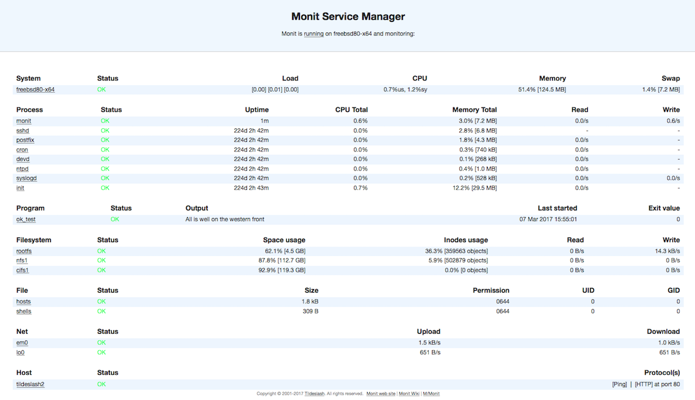
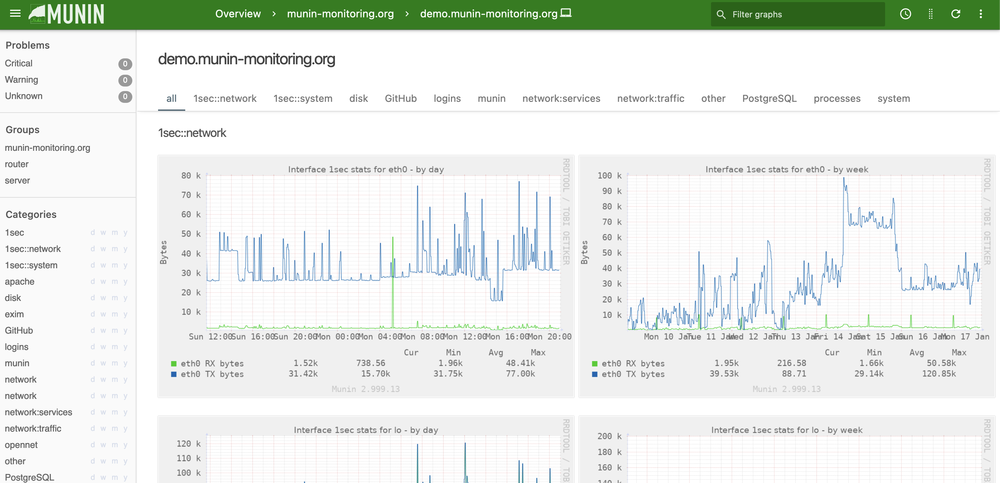
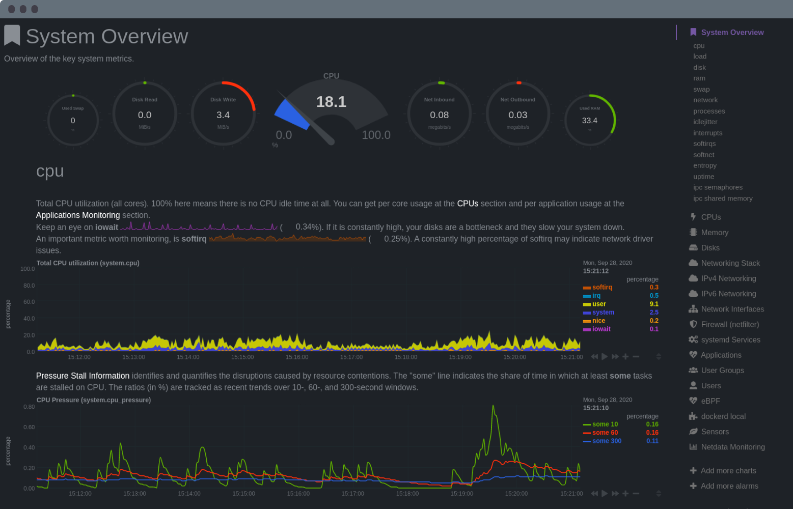
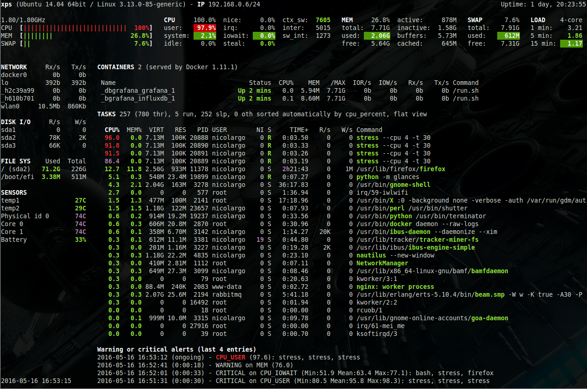



    

    





{}

You're a busy developer for a small shop. Besides writing code, you also take care of the odd server. Installing those is only half of the work. Making sure they keep working the other half. But there's no time. So here are four simple web-based Linux server monitoring tools you can slap on so you can continue with your day.

## Monit
Monit is old. And that is good. It is supported just about anywhere, and you can install it with your favourite package manager. There are many resources online, but it mainly works out of the box. Just enable the included 'httpd' daemon and get going. You start bare bones, but the default configuration file contains many examples. Go wild!
Monit offers commercial support with a SaaS offering. Convenient.

## Munin
Munin is old too! Still fantastic and under active development. The same arguments that hold for Monit hold for Munin. Where Monit is more geared toward alerting, Munin gives you graphs out of the box. You will need to install a webserver to get going, though. There are tons of plugins for just about everything. On Ubuntu, you can keep everything reasonably organized under `/etc/munin/plugins/`.

Beside Munin is named after one of Thor's ravens. What's not to like?

## Netdata
Netdata is the new kid on the block with tons and tons of graphs. Installing is easy, but you probably need to pipe some shell script hosted on a website into your shell. Be careful, folks! You can also opt for a Docker image.
Just like Monit, it comes with a commercial offering. The configuration is a  tad harder, and I was a little shocked to see the data shared on a public IP/port without me doing anything. Monit binds to localhost only, and with Munin, you need to set up a webserver first.

## Glances
Can't bear to leave the CLI behind? Glances got you covered. With this tool, you can monitor your server from the CLI. That interface is almost precisely copied to the web too! A webpage never looked so sexy. Glances rolls up `top`, `w`, `netstat`, `iotop` and a whole slew of others up in one tool. Pretty impressive. It doesn't do historical graphs.

Install Glances happens with `pip`. Not great, but not terrible either. A containerized version is available too. Or if you want to roll the dice, pipe some shell script, you got from the internet into your shell.

## Alerting

All four solutions support sending alerts in one way or the other. Remember, monitoring is useless without alerting! Therefore, I would argue that you are better off with half-decent altering than perfect monitoring.

Or you could create an account at Disk Notifier and let us do the heavy lifting. We monitor the primary cause of why servers go down: disk space issues.

{}


