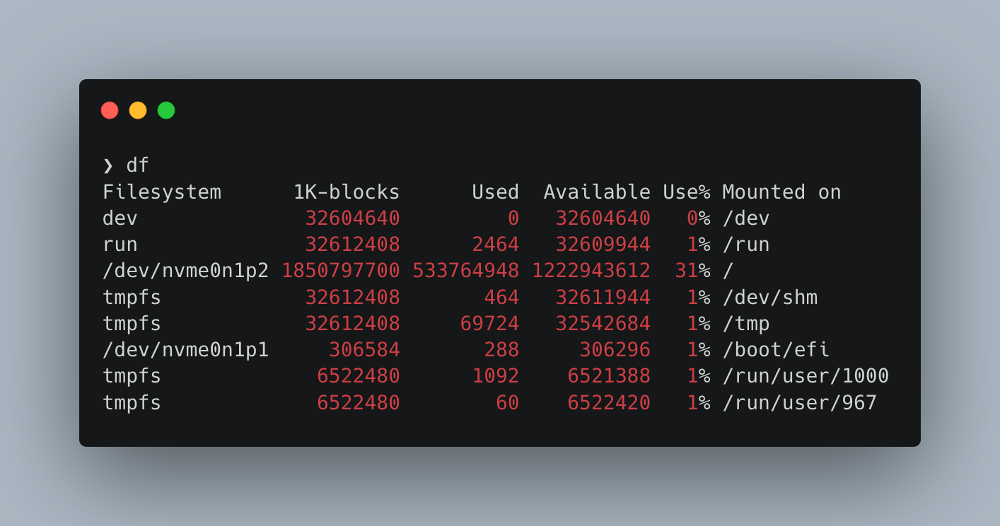



    

    





{}

Keeping tabs on free disk space is essential for a healthy machine. The command `df` is the go-to command to figure that out.

The `df` command is ancient. The initial release was in 1971, and it stands for '*d*isk *f*ree'. Because it is so old, you can safely assume it is present on just about any non-Windows machine. Its output is mostly self-explanatory. 

The second to last column is the most important. If something creeps toward 100%, it is time to act. But the other columns are informative too!

The only filesystems that are sometimes troublesome are the ones that have `/dev/*` in the 'Filesystem' column. You can think of these as the regular disks you see in your file browser.

Remember, everything in Linux is a file. That is why you find these odd `tmpfs` file systems. These are volatile file systems and stored in your RAM!

To make the 'Used' and 'Available' columns less intimidating, most versions of `df` support the `--human-readable` flag or `-h` for short.

With that flag, the output contains friendly units based on powers of 1024. Then it is easier to get a sense of what disk has what file system. If you prefer SI units, the flag `-H` shows those.

The remaining notable flag is `--print-type` or the shorthand `-T`. This will display the file system type, again helpful when finding that elusive file system when Docker or ZFS clutters up your output.

{}


