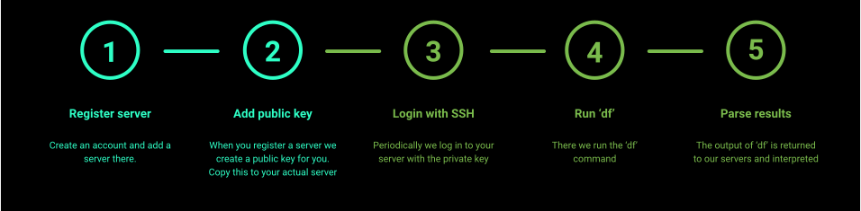
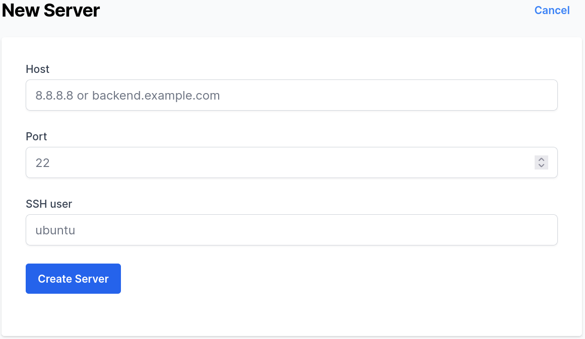
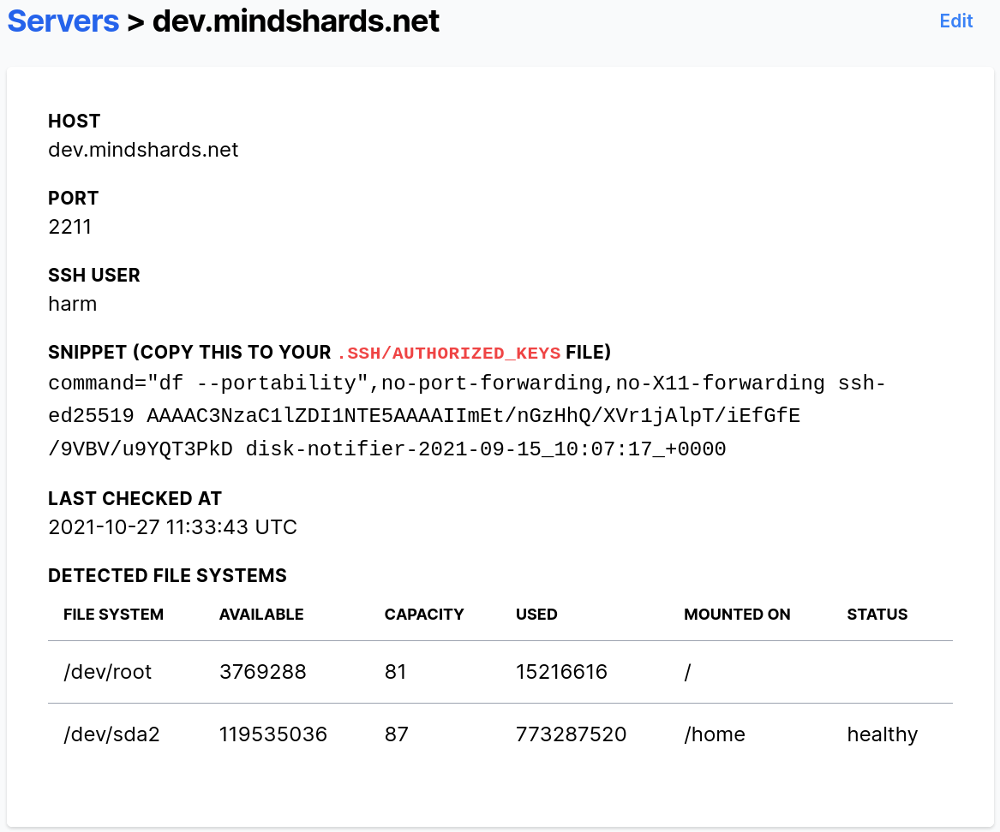



    

    





{}

Bringing a Linux server under monitoring is a two step process.

## Server monitoring in one glance

Only the first two steps are required. The steps 3, 4 and 5 we do.

## Dead simple monitoring

Letting us keep an eye on your Linux server is very easy. These are the things you do NOT need to do:
- No additional port needs to be open
- No extra software needs to be installed
- No updates are required
- No credit card is necessary
 
## Monitor a Linux or BSD server

All you need to do is [create an account](https://app.disknotifier.com) and add your server.

We need to know:
- what port SSH is running on
- what user you intent to install our key with
- at what IP address or host name your server can be found at

Once you have defined a server with us, we will generate a new SSH key for you and share the public key with you. We call it a snippet in this screenshot:

Grab this key (click on it) and append it to the `authorized_keys` file of the configured user. After a little while, our software will log in to your server and process the results.

## Why safer?

In general, people react shocked when we tell them we use SSH to log in to their server. So we've explained how this is safe [here](/blog/secrets-to-disk-space-monitoring/).

What people forget is that installing software increase their attack surface. The software you install contains bugs, and some of these bugs are exploitable. Not too long ago, even [fail2ban](https://research.securitum.com/fail2ban-remote-code-execution/) had a remote execution bug.  Worse still, you need to update the software to fix bugs found constantly.

Some software pushes metrics out, but others expose a port. Of course, this punches a hole in your firewall, and any hole is one hole too many.

Less is more.

{}


