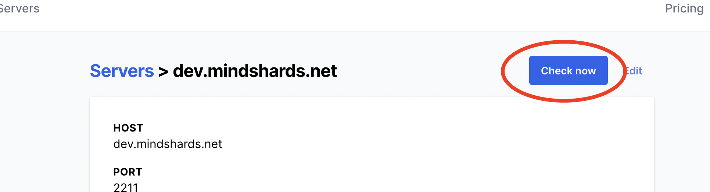
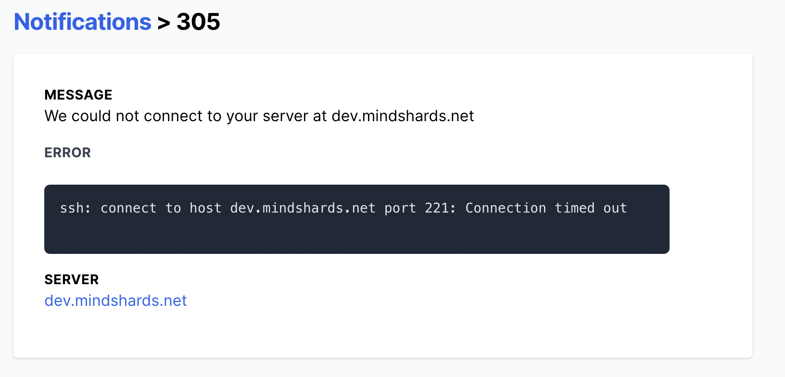



    

    





{}

We're really happy to have finalized two new features which make monitoring these Linux disk of yours a bit easier.

## Check now

Instant feedback is vital in any process. Be it while writing software or doing a new business. When Disk Notifier launched, it was fully functional. You add a server, and after a while, our backend would pick it up and schedule an inspection. Assuming you had copied our snippet correctly, it would work just swimmingly. However, it would be *great* to immediately find out if you copied the snippet you copied works!

Now you can. A new button 'check now' on the server details page will allow you to immediately schedule a check of your system. With the other new feature, you have what you need to debug those connection issues quickly!

## Error reporting

It's all great and awesome when you can instruct us to check the connection to our service immediately. But that doesn't help you when all you see is 'connection_error'. So that's why we now propagate the specific SSH error to you. You can read this error message in the notification telling you the connection failed. 

Enjoy these features! There's more to come. We're in it for the long haul.

{}


