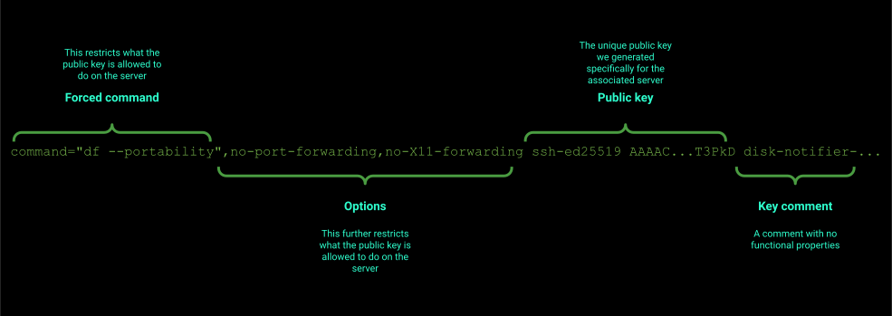



    

    





{}

Despite having the most straightforward tool in existence (only in my mind 🤪 of course!) I often find that people are confused by it.

## SSH + df

The secret sauce of Disk Notifier is SSH and the `df` Linux command. We log in to your server, run `df` and interpret the results. That is it. No specific version, nothing extra to install. You already have all the software installed!

People freak out when they read that Disk Notifier logs in to their server. While that is what we do, there is more to it.

## The full picture

Here's what each part of that one-liner does:

## Forced command

When you inspect the code snippet we give you, you see two parts that are out of the ordinary. 
Usually, an SSH public key contains a type field, like 'ssh-ed25519' or 'ssh-rsa'. Followed by a bunch of alphanumeric characters and an optional comment. The key you get from us adds two parts:
- a forced command
- additional options

A forced command is beautiful. It instructs the SSH daemon to execute this command, and only this command, when this particular key logs in. The connection terminates once the command finishes. Nothing this user does can make the SSH daemon run something else.

## Additional options

There is a caveat. What the user can do is prevent the command to run altogether. The `-N` flag of the ssh command does this. Then the user can set up a port forward or X11 forwarding with the `-L` flag. Highly undesirable. And that is where the additional options come in. They instruct the SSH daemon to ignore any such flag.

This way, adding the key of ours to your server is safe.

## Postprocessing

We have established that the connection Disk Notifier makes with your server is secure. What happens next?

As you can see in the one-liner, we execute `df` on your server. Our software then interprets the output and stores the result in our database. For there on a slew of background workers get to work on it. For example, there's one that determines if the disk is at risk of filling up. Determining if a message should be sent to the user is done by another worker. And yet another one who sends the Telegram message. 

## Future

At the moment, our alerts are relatively naive. When a disk hits the 90% full mark, we send an alert. But it matters quite a bit how big the disk is, to begin with. A huge disk might still have gigabytes of space left. Similarly, the speed at which the disk fills up matters. So expect progress in this area!

{}


